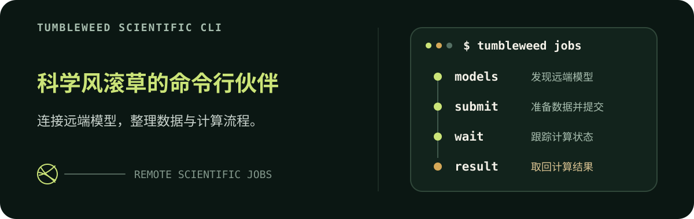

<p align="center">
  
</p>

# Tumbleweed CLI

`tumbleweed-cli`是配合“科学风滚草”项目使用的 CLI 工具。它把本地的数据与远端的科学模型接在一起，让模型发现、任务提交、状态跟踪和结果获取沿着同一套方式完成。

它的目标很简单：标准化常见的数据与计算操作，让研究者、开发者和 Agent 少关心调用细节，把注意力留给真正要解决的问题。

## 它能做什么

一次远端计算，通常会经过这样一条路径：

> **发现模型 → 准备数据 → 提交计算 → 跟踪状态 → 取回结果**

汤姆用 `tumbleweed jobs` 收拢了这段流程。模型及其输入要求来自远端 Worker，CLI 负责检查和上传本地文件、发起任务，再把状态、日志和结果带回本地。Worker 增加模型时，汤姆也可以直接发现它，不需要在客户端重复维护一份模型清单。

## 快速开始

使用 Node.js 22.18 或更高版本，通过 npm 安装：

```bash
npm install --global tumbleweed-scientific-cli
tumbleweed jobs health
tumbleweed jobs models
```

需要更新时运行：

```bash
npm update --global tumbleweed-scientific-cli
```

不希望安装 Node.js 时，也可以从 [GitHub Releases](https://github.com/yoko19191/tumbleweed-scientific-cli/releases) 下载适合当前平台的独立二进制文件。

需要连接另一台 Worker 时，通过环境变量指定地址：

```bash
export TUMBLEWEED_WORKER_URL="http://your-worker:9050/"
```

也可以直接从源码运行：

```bash
npm install
npm run dev -- jobs health
```

## 完成一次计算

不同模型需要的数据和参数并不相同。先查看模型说明，再提交任务，是最稳妥的使用方式：

```bash
tumbleweed jobs models esm3

tumbleweed jobs submit \
  --model esm3 \
  --input sequence=./input.fa \
  --param task=fold
```

提交后，使用返回的任务 ID 继续跟踪并获取结果：

```bash
tumbleweed jobs wait JOB_ID
tumbleweed jobs logs JOB_ID
tumbleweed jobs result JOB_ID --output-dir ./results
```

面向终端阅读时可以加上 `--human`；默认输出则保持为 JSON，方便 Agent 和脚本继续处理。

## 与 Agent 一起使用

仓库内的 [Agent Skills](.agents/skills) 不只告诉 Agent 怎样运行命令，也帮助它根据研究场景选择模型、准备正确的输入，并把结构预测、蛋白设计、分子对接和序列表示等任务串成完整流程。

想快速选择模型，可以从 [模型选择指南](docs/models/WHICH_MODELS_HELPS.md) 开始；需要具体任务范例时，查看 [模型任务配方](.agents/skills/use-tumbleweed-models/references/job-recipes.md)。

## 开发

```bash
npm run dev -- jobs --help
npm run check
```

`npm run check` 会依次运行测试与覆盖率检查、Lint、类型检查、格式检查和构建。项目要求语句与行覆盖率不低于 95%。

推送形如 `v0.1.0` 的版本标签后，GitHub Actions 会先完成质量检查与四平台构建，随后发布 npm 包，再把 macOS 与 Linux 的 x64、arm64 可执行文件发布到 GitHub Releases。

更多实现与验证资料可以在 [技术选型](docs/STACKS.md)、[端到端运行手册](docs/E2E_RUNBOOK.md) 和 [模型验证矩阵](docs/E2E_MODEL_MATRIX.md) 中找到。
